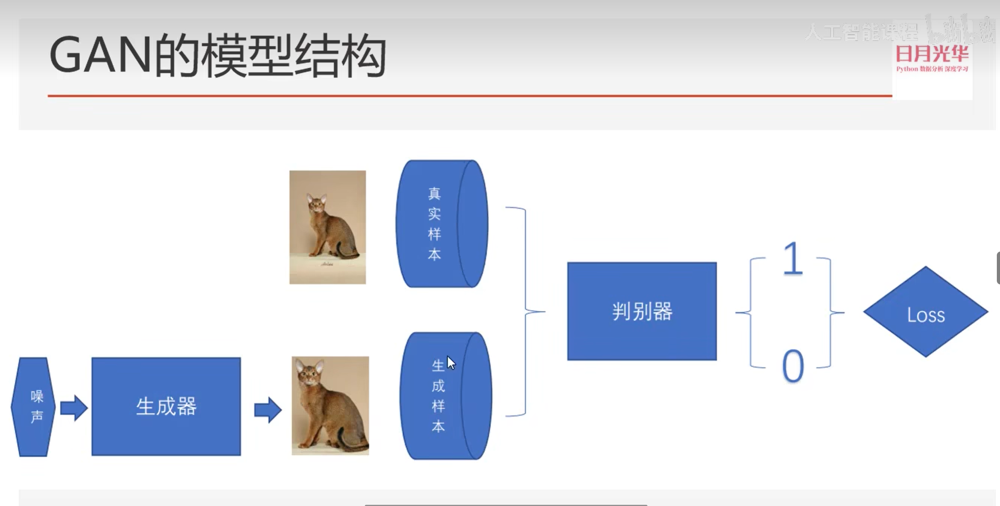
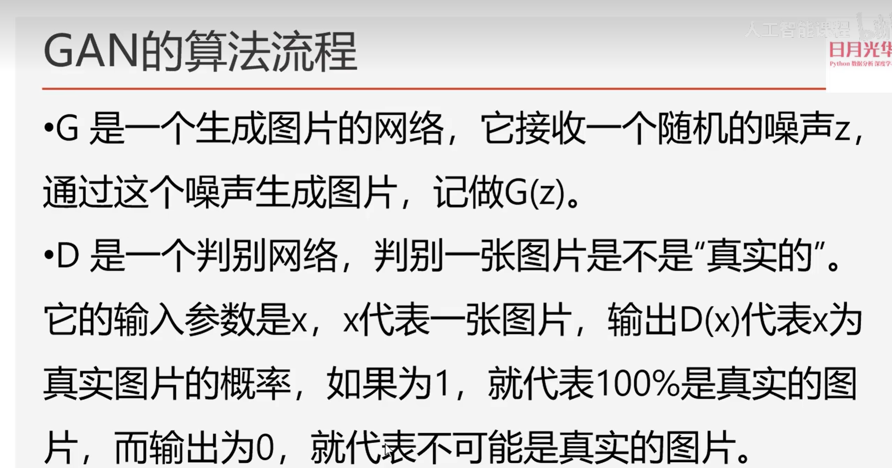
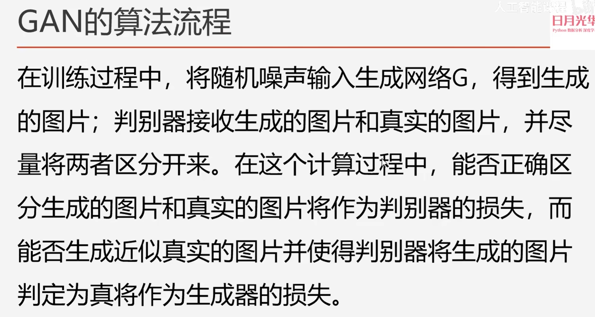
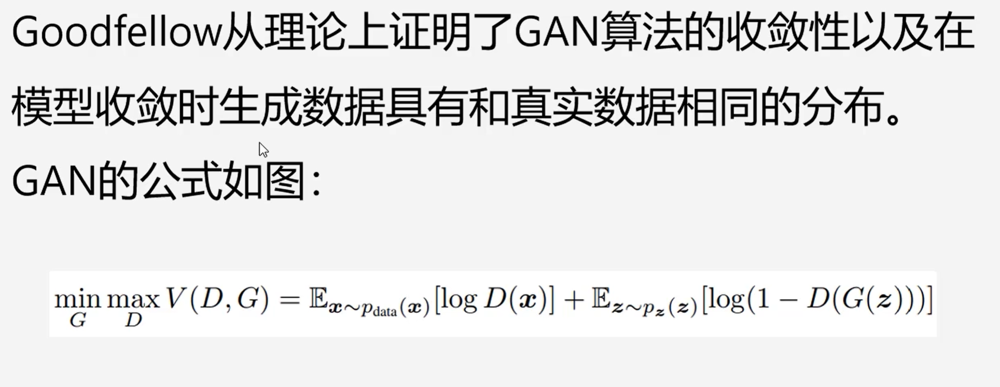

# Gan网络

> 生成器和判别器是亦敌亦友的关系

对于生成模型，损失函数很难定义->所以我们可以将生成模型的输出交给判别模型进行处理，来分辨好坏。

> 生成器的损失是通过判别器的输出来计算的，而判别器的输出是一个概率值，我们可以通过交叉熵计算。

> x：表示真实图片；z：表示输入G网络的噪声；G(z)：表示G网络生成的图片；D(*)：表示D网络判断图片是否真实的概论

公式中的 *V*(*D*,*G*) 是一个值函数，它衡量了在给定**生成器 *G* 和判别器 *D*** 的情况下，判别器的性能。这个值函数可以分解为两部分：

1. E*x*∼*p*data(*x*)[log*D*(*x*)]：这部分是判别器对真实数据 *x* 的预测的对数概率的期望。这里 *p*data(*x*) 是真实数据的分布。判别器 *D* 试图最大化这部分，因为它希望对真实数据的预测概率尽可能高。
2. E*z*∼*p**z*(*z*)[log(1−*D*(*G*(*z*)))]：这部分是判别器对生成器生成的数据 *G*(*z*) 的预测的对数概率的期望，但是这里我们取的是 1−*D*(*G*(*z*))，因为我们希望判别器能够识别出这些数据是假数据。这里 *p**z*(*z*) 是生成器的输入噪声的分布。判别器 *D* 试图最小化这部分，因为它希望对生成数据的预测概率尽可能低。

整个公式 min*G*max*D**V*(*D*,*G*) 表示生成器 *G* 试图最小化这个值函数，而判别器 *D* 试图最大化它。这形成了一个对抗过程，其中生成器不断学习如何生成更逼真的数据，而判别器不断学习如何更好地区分真假数据。

